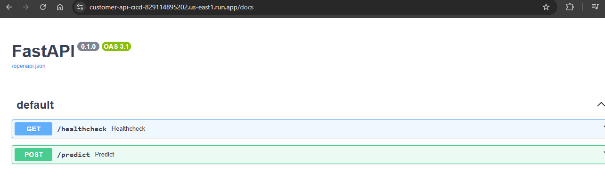
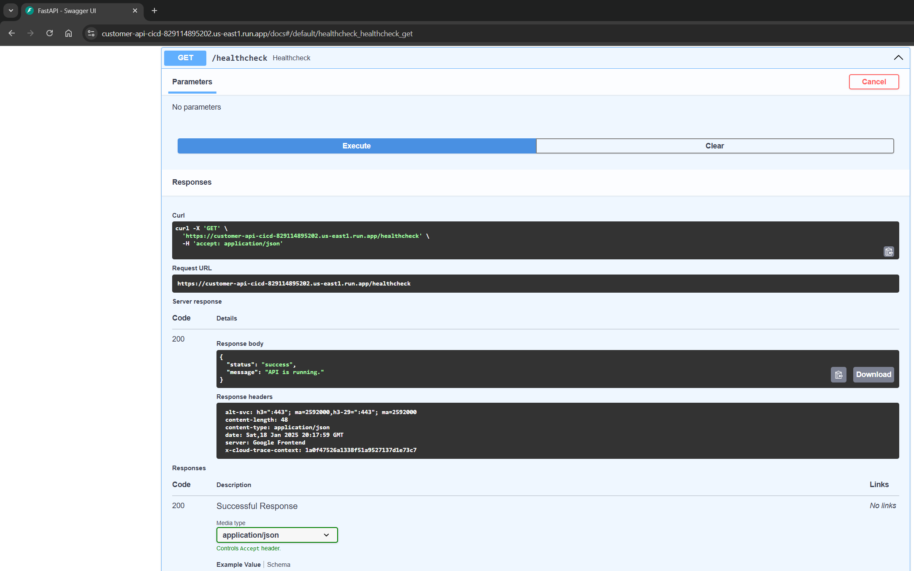
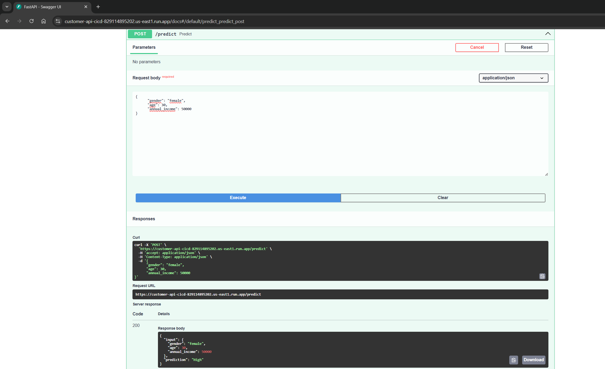
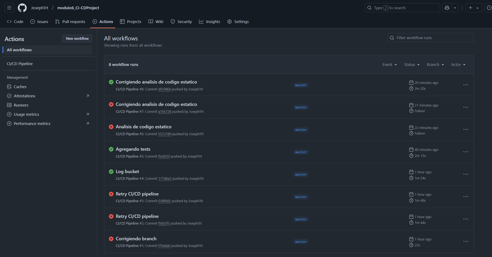
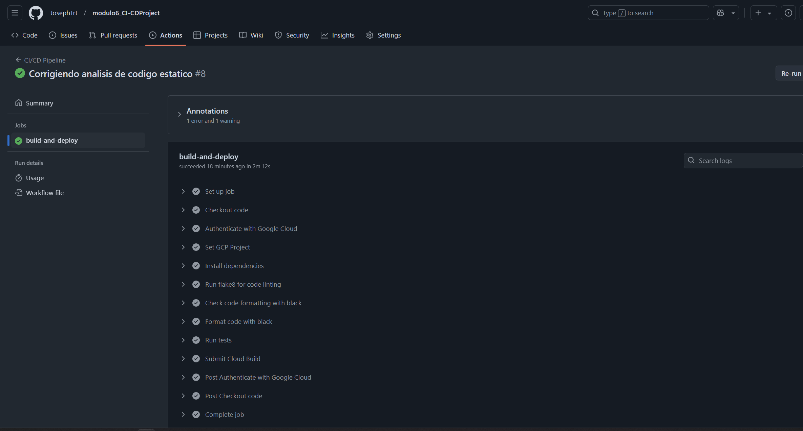
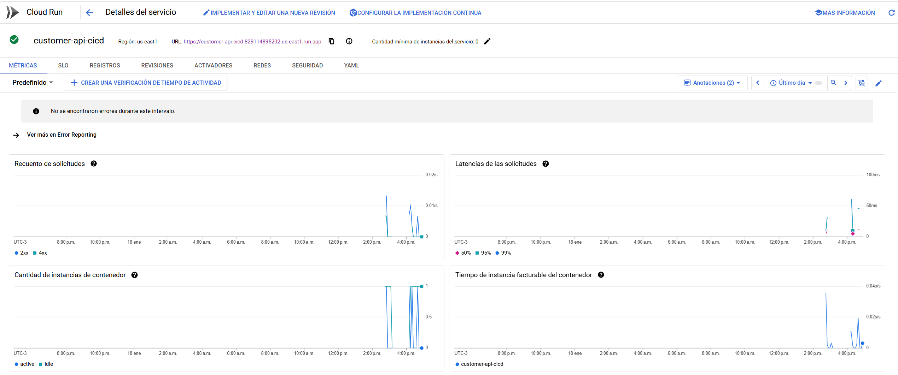
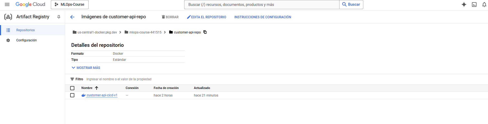

# Customer API Project

Este proyecto desarrolla una API para la gestión de datos de clientes, con funcionalidades que incluyen predicciones basadas en modelos, almacenamiento de datos y un pipeline CI/CD que asegura la calidad y despliegue continuo.

---

## **Tabla de Contenidos**

1. [Introducción](#introducción)
2. [Estructura del Proyecto](#estructura-del-proyecto)
3. [Endpoints y su Descripción](#endpoints-y-su-descripción)
4. [Pipeline CI/CD](#pipeline-cicd)
5. [Pruebas](#pruebas)
6. [Guía para Recrear el Proyecto en Local](#guía-para-recrear-el-proyecto-en-local)

---

## **Introducción**

El objetivo de este proyecto es construir una API robusta para manejar datos de clientes y realizar predicciones. Integra herramientas modernas para garantizar la calidad del código y un despliegue confiable en Google Cloud Run mediante un pipeline CI/CD.

---

## **Estructura del Proyecto**

Actualizada en base a la imagen proporcionada:

```plaintext
project/
├── .github/
│   └── workflows/
│       └── ci_cd.yaml   # Pipeline CI/CD
├── src/
│   ├── __pycache__
│   ├── tests/           # Pruebas unitarias
│   │   ├── __init__.py
│   │   ├── test_main.py
│   │   ├── test_predict.py
│   │   └── test_utils.py
│   ├── classifier.pkl   # Modelo entrenado
│   ├── customers.db     # Base de datos
│   ├── database.py      # Configuración de la base de datos
│   ├── main.py          # Lógica principal de la API
│   ├── models.py        # Definición de modelos
│   ├── schemas.py       # Esquemas de validación
│   └── utils.py         # Funciones auxiliares
├── .coverage            # Archivo de cobertura
├── .flake8              # Configuración de flake8
├── .gitignore           # Archivos ignorados por Git
├── cloudbuild.yaml      # Configuración para Cloud Build
├── Dockerfile.prod      # Dockerfile para entorno de producción
├── gcr-service-policy.yaml  # Políticas de servicio de GCP
├── requirements.txt     # Dependencias del proyecto
├── service.yaml         # Configuración de despliegue en Cloud Run
└── README.md            # Documentación del proyecto
```

---

## **Endpoints y su Descripción**
**URL del Servicio en GCP:** https://customer-api-cicd-829114895202.us-east1.run.app/

### **Swagger UI**
- La documentación interactiva está disponible en `/docs`. Puedes probar los endpoints directamente desde esta interfaz.



### **1. /healthcheck**
- **Método:** GET
- **Descripción:** Verifica el estado de la API.
- **Respuesta:**
  ```json
  {
      "status": "success",
      "message": "API is running."
  }
  ```



### **2. /predict**
- **Método:** POST
- **Descripción:** Realiza una predicción basada en los datos enviados.
- **Entrada:**
  ```json
  {
      "gender": "female",
      "age": 30,
      "annual_income": 50000
  }
  ```
- **Respuesta:**
  ```json
  {
      "input": {
          "gender": "female",
          "age": 30,
          "annual_income": 50000
      },
      "prediction": "High"
  }
  ```



---

## **Pipeline CI/CD**

### **Pasos del Pipeline (según `ci_cd.yaml`):**
1. **Checkout del Código:**
   - Obtiene el código desde el repositorio.
2. **Autenticación con GCP:**
   - Usa las credenciales almacenadas en GitHub Secrets para conectarse a Google Cloud.
3. **Instalación de Dependencias:**
   - Instala las bibliotecas necesarias desde `requirements.txt`.
4. **Análisis de Estilo:**
   - Ejecuta `flake8` para validar el cumplimiento con PEP8.
5. **Verificación de Formato:**
   - Usa `black` para comprobar y formatear el código.
6. **Ejecución de Pruebas:**
   - Ejecuta las pruebas unitarias con `pytest` y genera un informe de cobertura.
7. **Construcción de la Imagen:**
   - Construye la imagen Docker usando Cloud Build.
8. **Despliegue en Cloud Run:**
   - Despliega la imagen en Google Cloud Run usando `service.yaml`.




---

## **Pruebas**

### **Ejecución Local**
1. Ejecuta todas las pruebas unitarias:
   ```bash
   pytest src/tests/
   ```
2. Genera un informe de cobertura:
   ```bash
   pytest --cov=src --cov-report=term-missing src/tests/
   ```

### **Descripción de los Tests**
- **test_main.py:** Verifica el correcto funcionamiento de los endpoints.
- **test_predict.py:** Valida el modelo de predicción y su respuesta a entradas válidas y no válidas.
- **test_utils.py:** Prueba funciones auxiliares importantes para el proyecto.

---

## **Guía para Recrear el Proyecto en Local**

### **Requisitos Previos**
- Tener Python 3.10 instalado.
- Docker instalado para pruebas con contenedores.

### **Pasos**
1. **Clona el Repositorio:**
   ```bash
   git clone https://github.com/JosephTrt/modulo6_CI-CDProject.git
   cd modulo6_CI-CDProject
   ```
2. **Crea un Entorno Virtual:**
   ```bash
   python -m venv env
   source env/bin/activate  # En Windows: env\Scripts\activate
   ```
3. **Instala Dependencias:**
   ```bash
   pip install -r requirements.txt
   ```
4. **Ejecuta Localmente:**
   ```bash
   uvicorn src.main:app --reload
   ```
5. **Accede a la Documentación:**
   - Swagger: [http://127.0.0.1:8000/docs](http://127.0.0.1:8000/docs)
   

---
## Extras:



